# Stock Analysis: Phoenix Group Holdings plc (PHNX 2010 - 2025)

## The Predictometer

This project leverages advanced Machine Learning techniques to analyze and predict stock movements for Phoenix Group Holdings plc. Our goal is to provide accurate, data-driven insights to help investors make informed decisions. By evaluating key market indicators, and historical performance, Predictometer delivers powerful predictions to optimize investment strategies and manage risk effectively

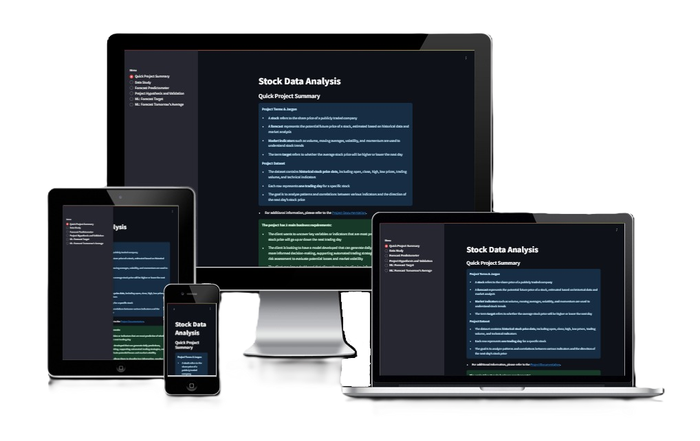

The project is accessible at:

- **Heroku**: [https://predictometer-af10797d000b.herokuapp.com](https://predictometer-af10797d000b.herokuapp.com)

- **Render**: [https://predictometer.onrender.com](https://predictometer.onrender.com)

## Dataset Content

- The dataset is sourced from [yfinance](https://ranaroussi.github.io/yfinance/), and is publicly available

- The dataset, based on [Phoenix Group Holdings plc](https://finance.yahoo.com/quote/PHNX.L/) from 2010 to 2025, consists of 3,788 rows and 8 columns, representing the daily price movement. Each row contains the date/time, open, high, low, close, volume, dividends, and stock splits

| Variable     | Values                                                 | Information                                                                                                                                                                                                                       |
| ------------ | ------------------------------------------------------ | --------------------------------------------------------------------------------------------------------------------------------------------------------------------------------------------------------------------------------- |
| date         | 2010-01-04 00:00:00+00:00 to 2024-12-31 00:00:00+00:00 | The date represents a timestamp in datetime format, ranging from January 4, 2010, to December 31, 2024. The format includes the year, month, and day (YYYY-MM-DD), followed by the time (midnight) and the UTC time zone (+00:00) |
| open         | 302.94 to 797.58                                       | open represents the opening price. The first traded price of the day                                                                                                                                                              |
| high         | 310.06 to 821.91                                       | high represents the highest price of the day                                                                                                                                                                                      |
| low          | 300.35 to 791.94                                       | low represents the lowest price of the day                                                                                                                                                                                        |
| close        | 300.35 to 800.31                                       | close represents the closing price. The last traded price of the day                                                                                                                                                              |
| volume       | 0 to 37073433                                          | volume represents the total number of shares traded (bought and sold) during the day                                                                                                                                              |
| dividends    | 0 to 26.65                                             | dividends represent the cash payments or stock distributions that a company gives to its shareholders as a portion of its profits                                                                                                 |
| stock splits | 0                                                      | stock splits represent a company's decision to increase the number of shares by issuing more shares to existing shareholders                                                                                                      |

## Exploratory Features and Targets

To analyze business requirements and identify patterns in the data, we performed feature extraction, which included adding lag features from previous price values and extracting components from the date values. Before doing so, we needed to impute any missing data to prevent gaps from affecting other columns. Upon inspection, there was no missing data, but the Volume column contained values of 0. To handle this, we applied Pandas forward fill (ffill) to propagate the last valid observation forward

Next, we extracted the day of the week, month, and the year from the Date column, after which we dropped the original Date column. We then created two days of lag features, which introduced two rows with NaN values at the start of the dataset. These rows were subsequently dropped. Additionally, to construct the classification and regression targets, we performed a shift of future values, which resulted in one NaN row at the end of the dataset, which we also removed. This brought the total number of dropped rows to three

Finally, we decided to drop the Dividends and Stock Splits columns as they held no meaningful value for the analysis. As a result, our stock dataset now consists of 3,785 rows and 23 columns

| Variable          | Values                                                                                           | Information                                                                                                   |
| ----------------- | ------------------------------------------------------------------------------------------------ | ------------------------------------------------------------------------------------------------------------- |
| year              | 2010 to 2024                                                                                     | year represents the calendar year during which stock trading activities occurred                              |
| month             | january, february, march, april, may, june, july, august, september, october, november, december | month represents the calendar month of trading activities                                                     |
| weekday           | monday, tuesday, wednesday, thursday, friday, sunday                                             | weekday represents the specific day of the week                                                               |
| open              | 302.94 to 797.58                                                                                 | open represents the opening price. The first traded price of the day                                          |
| high              | 310.06 to 821.91                                                                                 | high represents the highest price of the day                                                                  |
| low               | 300.35 to 791.94                                                                                 | low represents the lowest price of the day                                                                    |
| close             | 300.35 to 800.31                                                                                 | close represents the closing price. The last traded price of the day                                          |
| volume            | 34 to 37073433                                                                                   | volume represents the total number of shares traded (bought and sold) during the day                          |
| pre_open          | 302.94 to 797.58                                                                                 | pre_open represents the opening price from the previous day                                                   |
| pre_open_2        | 302.94 to 797.58                                                                                 | pre_open_2 represents the opening price two days prior                                                        |
| pre_high          | 310.06 to 821.91                                                                                 | pre_high represents the highest price of the previous day                                                     |
| pre_high_2        | 310.06 to 821.91                                                                                 | pre_high_2 represents the highest price two days prior                                                        |
| pre_low           | 300.35 to 791.94                                                                                 | pre_low represents the lowest price of the previous day                                                       |
| pre_low_2         | 300.35 to 791.94                                                                                 | pre_low_2 represents the lowest price two days prior                                                          |
| pre_close         | 300.35 to 800.31                                                                                 | pre_close represents the closing price of the previous day                                                    |
| pre_close_2       | 300.35 to 800.31                                                                                 | pre_close_2 represents the closing price two days prior                                                       |
| pre_vol           | 34 to 37073433                                                                                   | pre_vol represents the total number of shares traded on the previous day                                      |
| pre_vol_2         | 34 to 37073433                                                                                   | pre_vol_2 represents the total number of shares traded two days prior                                         |
| pre_average       | 302.94 to 797.87                                                                                 | pre_average represents the average price between open and close on the previous day                           |
| pre_average_2     | 302.94 to 797.87                                                                                 | pre_average_2 represents the average price between open and close two days prior                              |
| average           | 302.94 to 797.87                                                                                 | average represents the average price between open and close on the day                                        |
| tomorrows_average | 302.94 to 797.87                                                                                 | tomorrows_average represents the regression target for the next day's average price between open and close    |
| target            | 0, 1                                                                                             | target represents the classification target, indicating whether tomorrow's average is higher (1) or lower (0) |

## Business Requirements

BR1: The client wants to uncover key market indicators that are most predictive of whether the stock price will go up or down the next trading day

BR2: The client wants to develop a model that can predict whether the market is likely to move up or down on a daily basis. This will aid in making more informed trading decisions and support automated trading strategies

BR3: The client also requires a model to predict the daily average price of the stock, enabling better risk assessment and the evaluation of potential losses and market volatility

BR4: The client requires a dashboard that allows them to visualize key information, monitor daily predictions, and interact with data to support day-to-day decision-making

## Agile Methodology

### Epics

- Data Collection and Information Gathering
- Data Study and Visualization
- Data Cleaning, and Preparation
- Model Training, Optimization, and Validation
- Dashboard Planning, Design, and Development
- Dashboard Deployment and Release

### User Stories

- Data Collection and Information Gathering - Business Requirements 1, 2, 3

  - As a developer, I want to import historical stock data from an external data source into a Jupyter Notebook, so that I can conduct a thorough analysis of the dataset

    - Acceptance Criteria:

      - The stock dataset is successfully downloaded from Yahoo Finance
      - Stock data is successfully save to CSV format

- Data Study and Visualization - Business Requirement 1, 4

  - As a developer, I want to visualize the dataset to identify usable information and assess missing values, So that I can better prepare the data for analysis and ensure quality before modeling

    - Acceptance Criteria:

      - A data profile report must be generated
      - Visualize missing data

  - As a developer, I want to extract meaningful features and define the target variable, So that the data is ready for supervised learning and exploratory analysis

    - Acceptance Criteria:

      - Extract features for exploratory analysis
      - Define the target variable for supervised learning

  - As a developer, I want to visualize the correlation and predictive power of all features using heatmaps, So that I can identify patterns and relationships between variables that may inform model design

    - Acceptance Criteria:

      - Analysis Correlation and PPS with a heat map
      - Visualizations should demonstrate the effect of cleaning

- Data Cleaning, and Preparation - Business Requirements 1, 2, 3

  - As a developer, I want to implement a robust data cleaning process so that I can ensure the dataset is accurate, reliable, and of high quality

    - Acceptance Criteria:

      - Extract features and target data
      - All missing or null values in the dataset must be identified
      - Missing values are imputed
      - Visualize the effect of cleaning

- Model Training, Optimization, and Validation - Business Requirements 2, 3

  - As a developer, I want to evaluate the performance of the classification model so that I can ensure its reliability and accuracy in predicting market movements

    - Acceptance Criteria:

      - The classification model must be evaluated using appropriate metrics such as accuracy, precision, recall, and F1-score to ensure reliability and accuracy

  - As a developer, I want to evaluate the performance of the regression model so that I can ensure its reliability and accuracy in predicting daily average stock prices

    - Acceptance Criteria:

      - The regression model must be evaluated using appropriate metrics such as RMSE (Root Mean Squared Error), MAE (Mean Absolute Error), and R² (Coefficient of Determination)

- Dashboard Planning, Design, and Development - Business Requirements 4

  - As a client, I want to access the Streamlit landing page so that I can quickly gain an overview of the project

    - Acceptance Criteria:

      - The client should be able to quickly gain an overview of the project through the Streamlit landing page

- Dashboard Deployment and Release - Business Requirements 4

  - As a developer, I want to initiate the deployment process of my application on Render, or Heroku at an early stage so that I can conduct end-to-end manual deployment testing from the outset

    - Acceptance Criteria:

      - The application must be successfully deployed

## Hypothesis and how to validate?

1. The assumption that correlation patterns between date or volume and key market indicators, are strong enough to identify predictive relationships

- Correlation analysis revealed that neither date nor volume alone demonstrates significant forecasting power for price movement. These features may require deeper feature engineering or interaction with other variables to enhance predictability

2. Historical stock data, including key features like price and volume, can be used in a binary classification model to predict whether tomorrow's average price will be higher or lower than today’s, achieving an accuracy of at least 0.70

- The model achieved 0.71 accuracy on the training set and 0.70 accuracy on the test set, confirming that historical stock data can effectively predict whether tomorrow's average price will be higher or lower

3. A regression model trained on historical stock data can accurately forecast tomorrow's average price, and this forecast can be used to determine the directional change relative to today’s price

- The regression model trained on historical stock data demonstrates strong predictive performance, achieving an R² of 0.997 on the test set. This indicates that 0.997 of the variance in the average price is accurately captured by the model. Additionally, the low MAE (4.203) and RMSE (6.115) confirm precise forecasting with minimal error

## The rationale to map the business requirements to the Data Visualizations, ML tasks, and Interactive Dashboard

- Business Requirement 1: Data Visualization & Correlation Analysis

  - Correlation Study (Pearson, Spearman, and PPS) to assess how stock features relate to the target variables
  - Evaluate the significance of these correlations
  - Visualize important features in relation to stock price targets to better understand factors driving price movements and support forecasting models
  - This analysis is documented in the following notebook: [DataStudyandVisualisation.ipynb](https://github.com/AndyV773/PP5/blob/main/jupyter_notebooks/02%20-%20DataStudyandVisualisation.ipynb)

- Business Requirement 2: Price Movement Classification Analysis

  - Create a classification target indicating the stock price movement (e.g., higher or lower than the previous day's average price)
  - Perform classification analysis to build a predictive model based on this target
  - The goal is to predict stock price direction
  - This analysis is detailed in the following notebook: [Classification.ipynb](https://github.com/AndyV773/PP5/blob/main/jupyter_notebooks/05%20-%20Modeling%20and%20Evaluation%20-%20Classification.ipynb)

- Business Requirement 3: Price Prediction Regression Analysis

  - Create a regression target representing tomorrow’s average stock price
  - Perform regression analysis to build a predictive model based on this target
  - The goal is to predict tomorrow’s average stock price
  - This analysis is detailed in the following notebook: [Regression.ipynb](https://github.com/AndyV773/PP5/blob/main/jupyter_notebooks/06%20-%20Modeling%20and%20Evaluation%20-%20Regression.ipynb)

- Business Requirement 4: Interactive Dashboard for Risk Assessment and Decision Support

  - Develop an interactive dashboard to visualize key stock market metrics and daily prediction results
  - Provide interactive features allowing users to explore data
  - Support informed decision-making by integrating risk assessment tools and clear visual summaries
  - Code to the multipage dashboard can be found here: [app_pages](https://github.com/AndyV773/PP5/tree/main/app_pages)

## ML Business Case

### Business Requirements:

- The client wants to identify key market indicators that are highly predictive of whether the stock price of Phoenix Group Holdings plc (PHNX) will rise or fall on the next trading day. This includes understanding the influence of technical indicators, historical price movements, and market trends

- The client seeks to have a predictive model developed that can generate daily stock price forecasts for PHNX, support automated trading strategies, and incorporate risk assessment to evaluate potential losses and market volatility. The model should be optimized for accuracy and capable of reflecting real-time market dynamics

- The client requires an interactive dashboard that enables the visualization of key market indicators, daily predictions, and risk assessments. The dashboard should allow the client to monitor stock movements, explore predictions, and interact with data to support day-to-day trading decisions and risk management

### Can Traditional Data Analysis Be Used?

Traditional analysis could be used to observe historical trends and identify basic patterns, but it lacks the capacity for accurate predictions and real-time risk assessment. A machine learning model is necessary to capture complex relationships, seasonality, and market volatility for precise forecasting

### Does the Client Need a Dashboard or API?

The client requires a dashboard to visualize market movements, monitor predictions, and assess risk dynamically

### A Successful Project Outcome for the Client Is Defined As:

- An analysis that identifies the key indicators most correlated with stock price changes to support informed trading decisions

- Accurate daily predictions with a well-defined risk assessment to optimize buy/sell strategies

- A dashboard that allows for real-time monitoring of stock movements and model predictions

### Are There Any Ethical or Privacy Concerns?

The dataset is sourced from [yfinance](https://ranaroussi.github.io/yfinance/) and is publicly available. Therefore, there are no ethical or privacy concerns

### Are There Clear EPICS and User Stories for Agile Implementation?

Yes, EPICS have been defined and user stories have been created, organized, and tracked for agile implementation

**EPICS Are Broken Down As Follows:**

1. Information Gathering and Data Collection

2. Data Visualization, Cleaning, and Preparation

3. Model Training, Optimization, and Validation

4. Dashboard Planning, Design, and Development

5. Dashboard Deployment and Release

### Does the Data Suggest a Particular Model?

**Given the nature of the predictions, a combination of Linear Regression and Logistic Regression is appropriate:**

- Linear Regression will be used to predict the daily stock price values, capturing the relationships between historical prices and future movements

- Logistic Regression will be applied to predict the directional movement of the stock price (up or down) for the next trading day, based on key market indicators

**This approach leverages the strengths of both models:**

- Linear Regression for continuous value estimation (stock price)

- Logistic Regression for binary classification (price increase or decrease)

## What Are the Project Inputs and Intended Outputs?

**Model Inputs:**

- Historical stock data for Phoenix Group Holdings plc (PHNX), including Date features, Open, High, Low, Close, Volume, and exploratory data

**Outputs:**

- Daily price forecasts for PHNX stocks

- Directional movement predictions (up or down) for decision-making

- Risk assessment metrics for evaluating market probability

- Interactive visualizations on a dashboard for user engagement

The model will predict the next day's stock price based on historical patterns and key indicators. The dashboard will enable the client to explore predictions, assess risk, and simulate trading decisions

### What Does Success Look Like?

It is agreed that a R² score of at least 0.75 for both the training set and the test set defines success. In addition, the model must achieve a precision of at least 0.70 to ensure reliable performance in its predictions. The dashboard must also display predictions and risk metrics and interactive exploration capabilities, providing users with actionable insights and allowing them to dive deeper into the data

### How Will the Client Benefit?

**The client will benefit from:**

- More informed decision-making based on accurate daily predictions

- Optimized trading strategies with integrated risk assessment

- Clear visualization of key metrics for rapid market assessment

- The ability to interact with predictions through a streamlined dashboard, enhancing trading efficiency

## CRISP-DM

| Process                | Description                                                                                                                                                                     |
| ---------------------- | ------------------------------------------------------------------------------------------------------------------------------------------------------------------------------- |
| Business Understanding | Understand the client's objectives and business requirements, including predictive modeling, risk assessment, and interactive dashboard visualization                           |
| Data Understanding     | Collect and analyze historical stock data for Phoenix Group Holdings plc (PHNX) from 2010 to 2025, identify key variables, and evaluate data quality and completeness           |
| Data Preparation       | Clean, impute, and engineer features, including lag features, date components, and necessary transformations. Handle missing data and optimize the dataset for modeling         |
| Modeling               | Research and build predictive models to generate daily stock price forecasts, assess risk, and identify key indicators of market movement. Optimize for accuracy and robustness |
| Evaluation             | Evaluate model performance against business requirements, including risk assessment and prediction accuracy. Validate results with cross-validation and error analysis          |
| Deployment             | Develop and deploy an interactive dashboard that enables the client to visualize predictions, monitor risk, and interact with real-time data for informed decision-making       |

## Data Preprocessing

### Pandas forward fill was used to impute missing volume data after replacing zero values with NaN

From the initial YData profiling, it was observed that the volume column contains multiple rows with a value of 0. While zero volume might be plausible in early trading periods, it is highly unlikely in more recent years given the consistently high trading activity on surrounding dates. These zero values likely represent missing or erroneous data points rather than actual zero trading volume

To address this, all zero values in the volume column were replaced with NaN. These missing values were then imputed using pandas’ forward fill method, which propagates the last valid observation forward to fill gaps. This approach preserves the continuity of volume data and is appropriate given the temporal nature of the data

The forward-filled volume data was then used as the basis for creating lag features, ensuring that these engineered variables reflect more accurate and realistic trading volumes

### Feature Engineering

- Date/time extraction:

  - The original date column was split into separate features: year, month, and weekday. This transformation helps capture temporal patterns and seasonality that may influence the target variable, improving the model’s ability to learn time-based trends

- Creation of Lag Features for Time Series Analysis:

  - Lag features were created for key variables such as open, close, high, low, volume, and average price. These features represent the previous day’s values and help the model capture temporal dependencies and trends in the stock data

- Encoding categorical variables:

  - Ordinal encoding was applied to the categorical date-related variables, 'month' and 'weekday', to convert them into numerical format suitable for model training

- Exploration of Alternative Feature Transformations:
  - Various transformation methods such as Winsorization for outlier treatment and the Yeo-Johnson power transformation were explored; however, the model performed better without applying these transformations

## Dashboard Design

Business requirements covered:

- **Business Requirement 4: Interactive Dashboard for Risk Assessment and Decision Support**

### Streamlit sidebar

- The Streamlit sidebar provides quick navigation and easy access to different sections of the app, enhancing user experience and usability
  - Quick Project Summary
  - Data Study
  - Forecast Predictometer
  - Project Hypothesis and Validation
  - ML: Forecast Target
  - ML: Forecast Tomorrow's Average

<details>
<summary>Sidebar</summary>
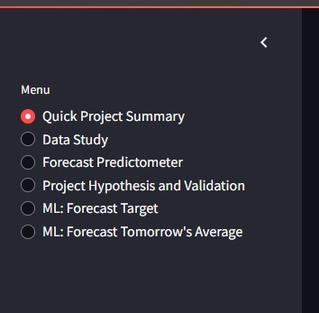
</details>

### Page 1: Quick Project Summary

This page shows a summary of:

<details>
<summary>Project Terms & Jargon</summary>

- **stock** refers to the share price of a publicly traded company

- **forecast** represents the potential future price of a stock, estimated based on historical data and market analysis

- **Market indicators** such as volume, moving averages, volatility, and momentum are used to understand stock trends

- The term **target** refers to whether the average stock price will be higher or lower the next day
</details>

<details>
<summary>Project Dataset</summary>

- The dataset contains historical stock price data, including open, close, high, low prices, trading volume, and technical indicators

- Each row represents one trading day for a specific stock

- The goal is to analyze patterns and correlations between various indicators and the direction of the next day’s stock price
</details>

<details>
<summary>Business requirements</summary>

- The client wants to uncover key variables or indicators that are most predictive of whether the stock price will go up or down the next trading day

- The client wants to develop a model that can predict whether the market is likely to move up or down on a daily basis. This will aid in making more informed trading decisions and support automated trading strategies

- The client also requires a model to predict the daily average price of the stock, enabling better risk assessment and the evaluation of potential losses and market volatility

- The client requires a dashboard that allows them to visualize key information, monitor daily predictions, and interact with data to support day-to-day decision-making
</details>

<details>
<summary>Quick Project Summary (Screenshot)</summary>
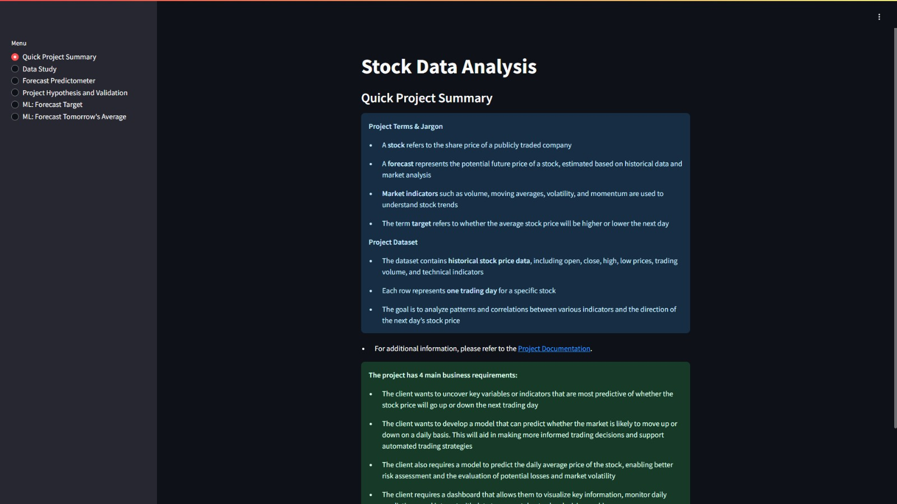
</details>

### Page 2: Data Study

Business requirements covered:

- **Business Requirement 1: Data Visualization & Correlation Analysis**

This page shows:

#### Data

<details>
<summary>Raw Data</summary>

10 rows and 8 columns

| date                      | open   | high   | low    | close  | volume | divided | stock split |
| ------------------------- | ------ | ------ | ------ | ------ | ------ | ------- | ----------- |
| 2010-01-04 00:00:00+00:00 | 477.74 | 477.74 | 497.72 | 503.86 | 13401  | 0       | 0           |
| 2010-01-05 00:00:00+00:00 | 506.97 | 506.97 | 497.72 | 510.01 | 10729  | 0       | 0           |
| 2010-01-06 00:00:00+00:00 | 497.72 | 497.72 | 497.72 | 497.72 | 0      | 0       | 0           |
| 2010-01-07 00:00:00+00:00 | 507.19 | 503.27 | 503.27 | 507.19 | 6169   | 0       | 0           |
| 2010-01-08 00:00:00+00:00 | 503.27 | 503.27 | 503.27 | 503.27 | 0      | 0       | 0           |
| 2010-01-11 00:00:00+00:00 | 503.27 | 503.27 | 503.27 | 503.27 | 0      | 0       | 0           |
| 2010-01-12 00:00:00+00:00 | 499.57 | 499.57 | 499.57 | 499.57 | 0      | 0       | 0           |
| 2010-01-13 00:00:00+00:00 | 496.54 | 496.54 | 503.27 | 496.54 | 3017   | 0       | 0           |
| 2010-01-14 00:00:00+00:00 | 501.42 | 501.42 | 501.42 | 501.42 | 0      | 0       | 0           |
| 2010-01-15 00:00:00+00:00 | 492.17 | 492.17 | 499.57 | 492.17 | 1862   | 0       | 0           |

</details>

<details>
<summary>Exploratory Data</summary>

10 rows and 23 columns

| year | month   | weekday   | open            | high            | low             | close           | volume | pre_open        | pre_open_2      | pre_high        | pre_high_2      | pre_low         | pre_low_2       | pre_close       | pre_close_2     | pre_vol | pre_vol_2 | pre_average     | pre_average_2   | average         | tomorrows_average | target |
| ---- | ------- | --------- | --------------- | --------------- | --------------- | --------------- | ------ | --------------- | --------------- | --------------- | --------------- | --------------- | --------------- | --------------- | --------------- | ------- | --------- | --------------- | --------------- | --------------- | ----------------- | ------ |
| 2010 | January | Wednesday | 497.69482421875 | 497.69482421875 | 497.69482421875 | 497.69482421875 | 10729  | 506.94560580931 | 477.71297483554 | 509.97990627457 | 503.83736524666 | 506.94560580931 | 477.71297483554 | 497.69482421875 | 497.69482421875 | 10729   | 13401     | 502.32021501403 | 487.70389952714 | 497.69482421875 | 505.20653102339   | 1      |
| 2010 | January | Thursday  | 507.16770071865 | 507.16770071865 | 503.24536132813 | 503.24536132813 | 6169   | 497.69482421875 | 506.94560580931 | 497.69482421875 | 509.97990627457 | 497.69482421875 | 506.94560580931 | 497.69482421875 | 497.69482421875 | 10729   | 10729     | 497.69482421875 | 502.32021501403 | 505.20653102339 | 503.24536132813   | 0      |
| 2010 | January | Friday    | 503.24536132813 | 503.24536132813 | 503.24536132813 | 503.24536132813 | 6169   | 507.16770071865 | 497.69482421875 | 507.16770071865 | 497.69482421875 | 503.24536132813 | 497.69482421875 | 503.24536132813 | 497.69482421875 | 6169    | 10729     | 505.20653102339 | 497.69482421875 | 503.24536132813 | 503.24536132813   | 0      |
| 2010 | January | Monday    | 503.24536132813 | 503.24536132813 | 503.24536132813 | 503.24536132813 | 6169   | 503.24536132813 | 507.16770071865 | 503.24536132813 | 507.16770071865 | 503.24536132813 | 503.24536132813 | 503.24536132813 | 503.24536132813 | 6169    | 6169      | 503.24536132813 | 505.20653102339 | 503.24536132813 | 499.54504394531   | 0      |
| 2010 | January | Tuesday   | 499.54504394531 | 499.54504394531 | 499.54504394531 | 499.54504394531 | 6169   | 503.24536132813 | 503.24536132813 | 503.24536132813 | 503.24536132813 | 503.24536132813 | 503.24536132813 | 503.24536132813 | 503.24536132813 | 6169    | 6169      | 503.24536132813 | 503.24536132813 | 499.54504394531 | 499.87805739097   | 1      |
| 2010 | January | Wednesday | 496.51075345382 | 496.51075345382 | 496.51075345382 | 503.24536132813 | 3017   | 499.54504394531 | 503.24536132813 | 499.54504394531 | 503.24536132813 | 499.54504394531 | 503.24536132813 | 499.54504394531 | 503.24536132813 | 6169    | 6169      | 499.54504394531 | 503.24536132813 | 499.87805739097 | 501.39517211914   | 1      |
| 2010 | January | Thursday  | 501.39517211914 | 501.39517211914 | 501.39517211914 | 501.39517211914 | 3017   | 496.51075345382 | 499.54504394531 | 496.51075345382 | 499.54504394531 | 496.51075345382 | 499.54504394531 | 503.24536132813 | 499.54504394531 | 3017    | 6169      | 499.87805739097 | 499.54504394531 | 501.39517211914 | 495.84467640552   | 0      |
| 2010 | January | Friday    | 492.14430886572 | 492.14430886572 | 492.14430886572 | 499.54504394531 | 1862   | 501.39517211914 | 496.51075345382 | 501.39517211914 | 496.51075345382 | 501.39517211914 | 496.51075345382 | 501.39517211914 | 503.24536132813 | 3017    | 3017      | 501.39517211914 | 499.87805739097 | 495.84467640552 | 501.39517211914   | 1      |
| 2010 | January | Monday    | 501.39517211914 | 501.39517211914 | 501.39517211914 | 501.39517211914 | 1862   | 492.14430886572 | 501.39517211914 | 492.14430886572 | 501.39517211914 | 492.14430886572 | 501.39517211914 | 499.54504394531 | 501.39517211914 | 1862    | 3017      | 495.84467640552 | 501.39517211914 | 501.39517211914 | 499.54504394531   | 0      |
| 2010 | January | Tuesday   | 499.54504394531 | 499.54504394531 | 499.54504394531 | 499.54504394531 | 1862   | 501.39517211914 | 492.14430886572 | 501.39517211914 | 492.14430886572 | 501.39517211914 | 492.14430886572 | 501.39517211914 | 499.54504394531 | 1862    | 1862      | 501.39517211914 | 495.84467640552 | 499.54504394531 | 488.44402047757   | 0      |

</details>

#### Stock Charts

<details>
<summary>Line Chart</summary>
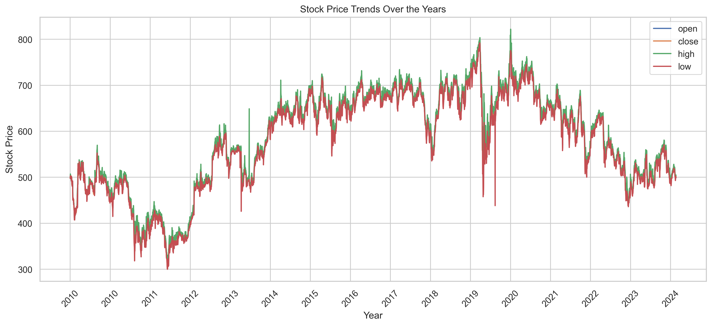
</details>

<details>
<summary>Bar Graph</summary>
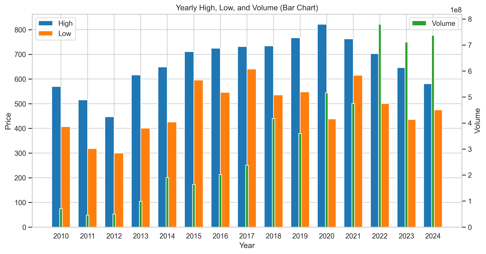
</details>

#### Correlation Study

A correlation study of the Smart Correlated Selection variable was conducted, including plots for `['month', 'weekday', 'high']`, along with Spearman and Pearson correlation heatmaps, as well as a PPS (Predictive Power Score) heatmap

<details>
<summary>Spearman Correlation</summary>
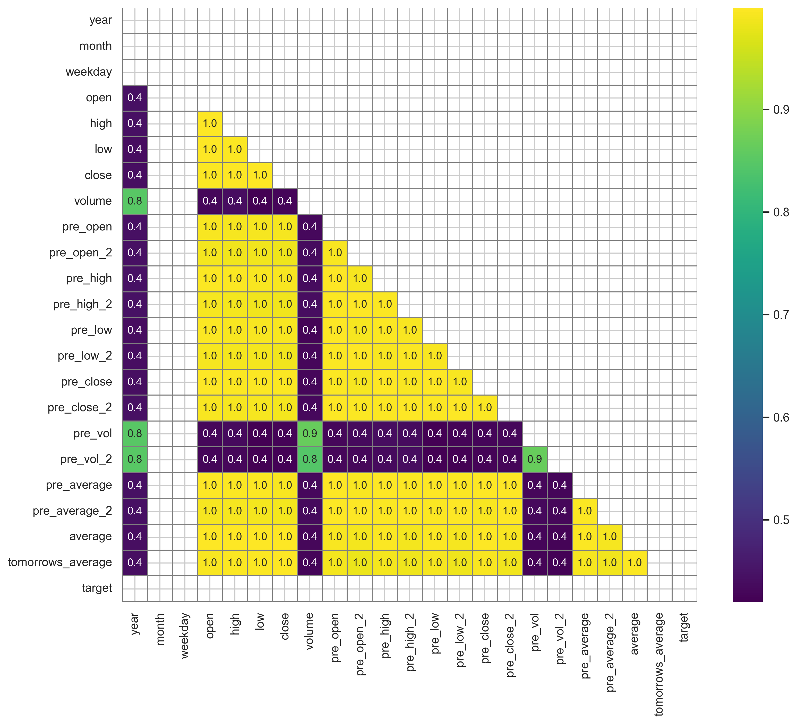
</details>

<details>
<summary>Pearson Correlation</summary>
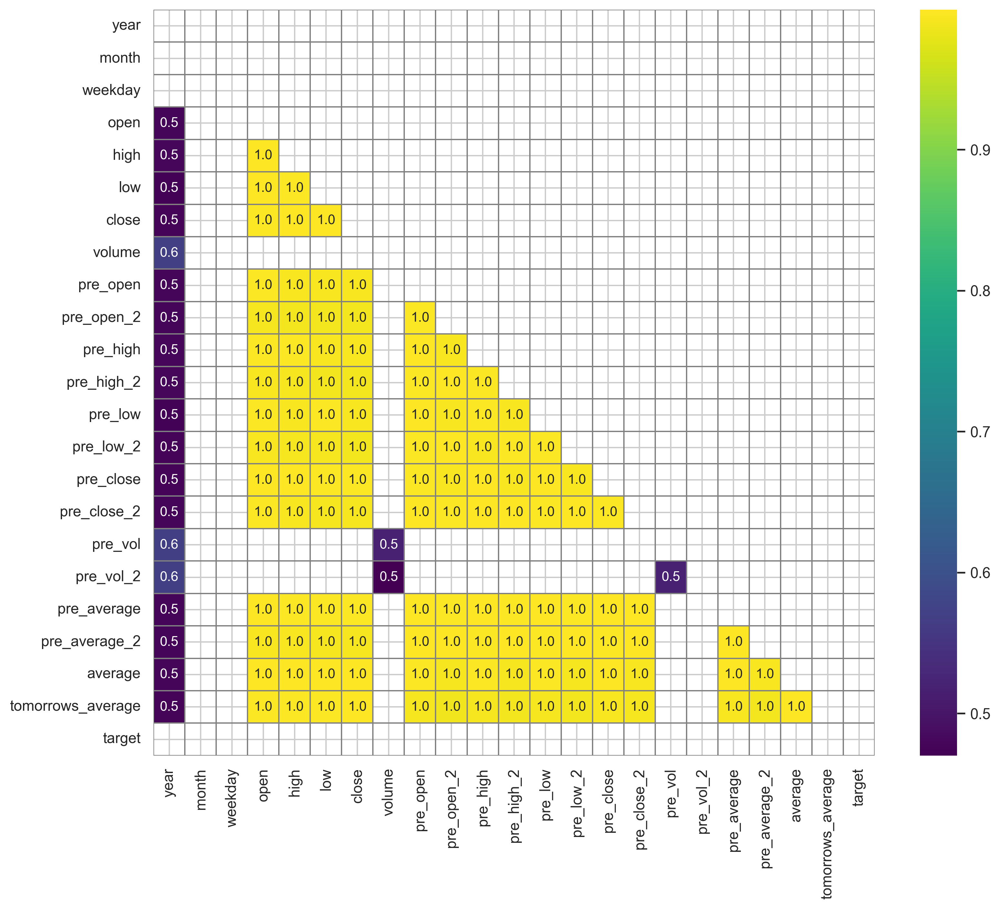
</details>

<details>
<summary>PPS Matrix</summary>
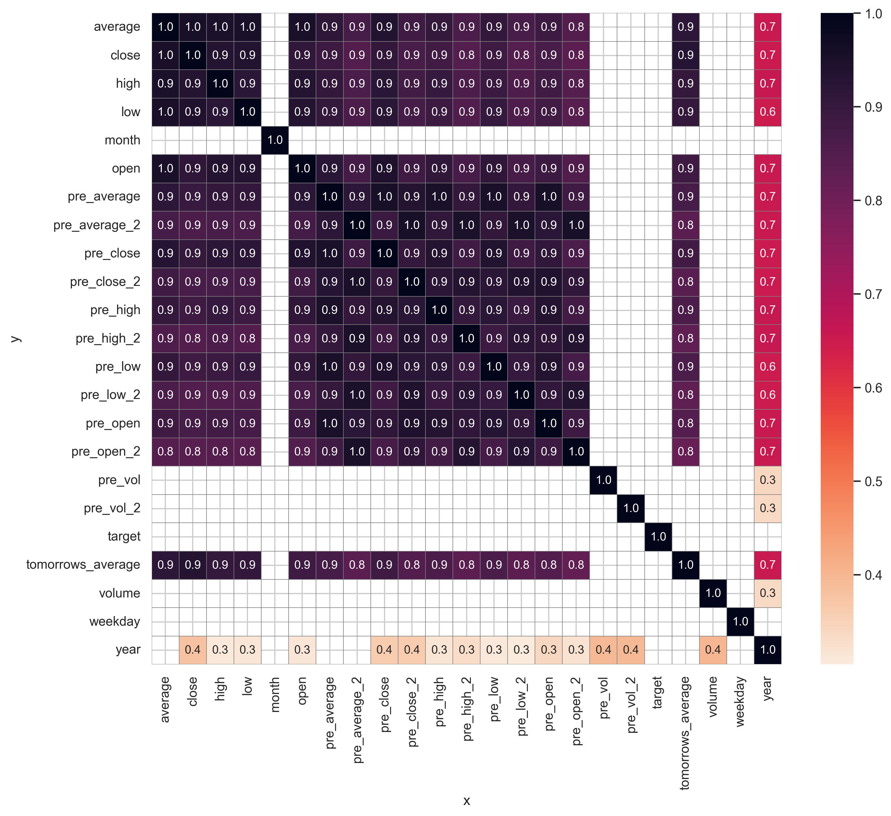
</details>

<details>
<summary>Data Study (Screenshot)</summary>
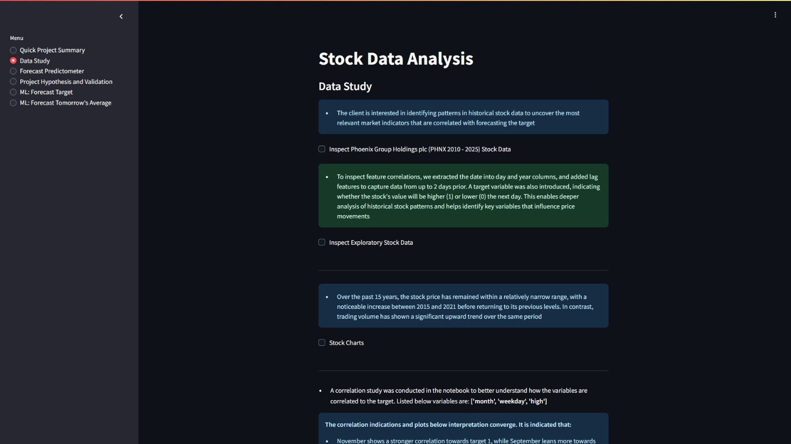
</details>

### Page 3: Forecast Predictometer

Business requirements covered:

- **Business Requirement 2: Price Movement Classification Analysis**

- **Business Requirement 3: Price Prediction Regression Analysis**

This page consists of the main machine learning pipelines designed to perform stock forecasts, predicting tomorrow's average price and whether it will be higher or lower, along with a probability percentage. It also includes a brief introduction to the client's needs and a checkbox for testing with sample stock data

<details>
<summary>Stock Data</summary>

5 rows and 5 columns

| close             | open              | pre_Close        | high              | average           |
| ----------------- | ----------------- | ---------------- | ----------------- | ----------------- |
| 497.69482421875   | 497.69482421875   | 497.69482421875  | 497.69482421875   | 497.69482421875   |
| 503.245361328125  | 507.1677007186535 | 497.69482421875  | 507.1677007186535 | 505.2065310233893 |
| 503.245361328125  | 503.245361328125  | 503.245361328125 | 503.245361328125  | 503.245361328125  |
| 503.245361328125  | 503.245361328125  | 503.245361328125 | 503.245361328125  | 503.245361328125  |
| 499.5450439453125 | 499.5450439453125 | 503.245361328125 | 499.5450439453125 | 499.5450439453125 |

</details>

It contains four main input widgets for float values: 'close,' 'open,' 'pre_close,' and 'high.' The 'open' and 'close' widgets automatically compute the 'average' value, which then can to run the machine learning forecast

<details>
<summary>Forecast Predictometer (Screenshot)</summary>
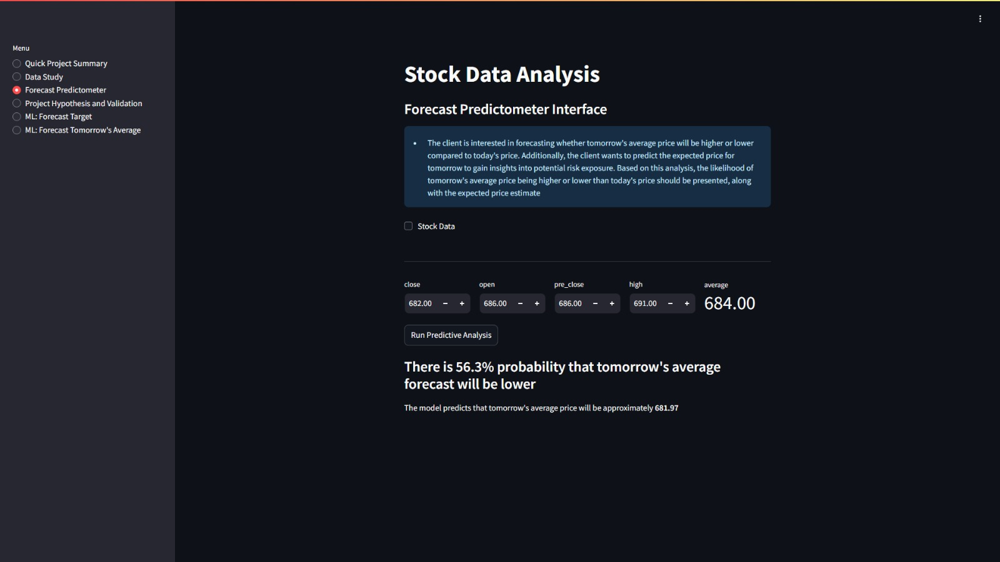
</details>

### Page 4: Project Hypothesis and Validation

This page contains the hypothesis and its validation, with success widgets for correct hypotheses and error widgets for incorrect ones

- The assumption that correlation patterns between date or volume and key market indicators, are strong enough to identify predictive relationships

  - Correlation analysis revealed that neither date nor volume alone demonstrates significant forecasting power for price movement. These features may require deeper feature engineering or interaction with other variables to enhance predictability

- Historical stock data, including key features like price and volume, can be used in a binary classification model to predict whether tomorrow's average price will be higher or lower than today’s, achieving an accuracy of at least 0.70

  - The model achieved 0.71 accuracy on the training set and 0.70 accuracy on the test set, confirming that historical stock data can effectively predict whether tomorrow's average price will be higher or lower

- A regression model trained on historical stock data can accurately forecast tomorrow's average price, and this forecast can be used to determine the directional change relative to today’s price

  - The regression model trained on historical stock data demonstrates strong predictive performance, achieving an R² of 0.997 on the test set. This indicates that 0.997 of the variance in the average price is accurately captured by the model. Additionally, the low MAE (4.203) and RMSE (6.115) confirm precise forecasting with minimal error

<details>
<summary>Project Hypothesis and Validation (Screenshot)</summary>
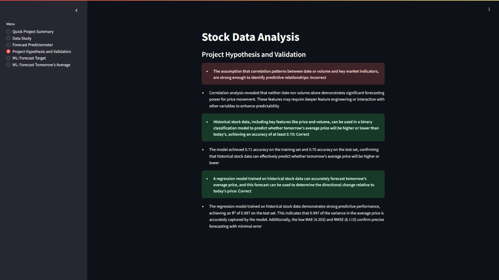
</details>

## Unfixed Bugs

When running HyperparameterOptimizationSearch() with GridSearchCV for XGBClassifier, a warning appears due to non-finite test scores ([nan])

Notes:

- Dataset has been thoroughly tested for missing and infinite values—none found

- All feature data types are numeric (float and int)

- Target classes are well balanced

- All lagged features (previous open, close, high, low, volume, etc.) have been dropped to reduce redundancy, but the issue persists

- Log transformation was applied to features in an attempt to resolve the issue (to reduce skewness, stabilize variance, and handle extreme values), but no improvement was observed

- The root cause of the warning is currently unknown and requires further investigation

## Deployment

Fork or clone this: [repository](https://github.com/AndyV773/PP5)

- For Streamlit app, setup a `setup.sh` file with the following content:

```bash
mkdir -p ~/.streamlit/
echo "\
[server]\n\
headless = true\n\
port = $PORT\n\
enableCORS = false\n\
\n\
" > ~/.streamlit/config.toml

```

### Heroku

- The App live link is: [https://predictometer-af10797d000b.herokuapp.com/](https://predictometer-af10797d000b.herokuapp.com/)

Heroku requires 3 additional files for deployment

- `requirements.txt`
- `Procfile`
- `.python_version`

Ensure `Procfile` contains following command:

```bash
web: sh setup.sh && streamlit run app.py
```

Set the `.python_version` file to a Python version supported by [Heroku-24](https://devcenter.heroku.com/articles/python-support#supported-runtimes) stack. Version used:

```bash
3.12.8
```

- The project was deployed to **Heroku** using the following steps:

1. Log in to Heroku and create an App

2. At the Deploy tab, select GitHub as the deployment method

3. Select your repository name and click Search. Once it is found, click Connect

4. Select the branch you want to deploy, then click Deploy Branch

5. The deployment process should happen smoothly if all deployment files are fully functional. Click now the button Open App on the top of the page to access your App

6. If the slug size is too large then add large files not required for the app to the `.slugignore` file

### Render

- The App live link is: [https://predictometer.onrender.com/](https://predictometer.onrender.com/)

Render requires 1 additional files for deployment

- `requirements.txt`

The project was deployed to **Render** using the following steps:

1. Log in to Render.com using Github

2. Click on the New button, select Web Service

3. At Source Code, select Git Providor. Select your repository name. Click Connect

4. Enter a unique name for your web service

5. Select the Python3 language

6. Select the main branch

7. Select the Frankfurt (EU Central) Region

8. Set the Build Command:

```bash
pip install -r requirements.txt && ./setup.sh
```

9. Set the Start Command:

```bash
streamlit run app.py
```

10. Set Instance Type: Free

11. Set the Environment Variables:

- Key: `PORT`, Value: `8501`

- Key: `PYTHON_VERSION`, Value: `3.12.8`

12. Click Deploy Web Service

## Technologies

- **Github:** The project's source code is hosted on GitHub at [https://github.com/](https://github.com/)

- **Visual Studio Code:** Code editing and development were performed using Visual Studio Code (Version 1.99.3), running locally on a desktop environment [https://code.visualstudio.com/](https://code.visualstudio.com/)

- **Heroku:** The web application is deployed on Heroku at [https://id.heroku.com/](https://id.heroku.com/)

- **Render:** The web application is deployed on Render at [https://render.com/](https://render.com/)

- **CI Python Linter:** Code formatting and adherence to PEP8 standards were ensured using the CI Python Linter at [https://pep8ci.herokuapp.com/](https://pep8ci.herokuapp.com/)

- **Flake8 Linter in VS Code:** Flake8 linter in VS Code was used to assist with code style and PEP8 compliance [https://flake8.pycqa.org/](https://flake8.pycqa.org/)

- **Prettier Formatter in VS Code:** Prettier was used in VS Code to auto-format Markdown files, ensuring consistent style and readability [https://prettier.io/](https://prettier.io/)

## Main Data Analysis and Machine Learning Libraries and Frameworks

### Core Data Processing & Numerical Libraries

- `numpy==1.26.1`: Foundational library for numerical operations, supporting arrays and mathematical functions

- `pandas==2.2.3`: Essential library for data manipulation and analysis using DataFrames and Series

### Visualization Libraries

- `matplotlib==3.8.0`: Widely used for creating static, animated, and interactive visualizations

- `seaborn==0.13.2`: Built on top of Matplotlib that simplifies creating attractive and informative graphs

- `plotly==5.17.0`: Enables interactive plots, dashboards, and web-based visualizations

### Exploratory Data Analysis Tools

- `ydata-profiling[notebook]==4.12.0`: Generates detailed EDA reports, summarizing data characteristics, correlations, and missing values

- `ppscore==1.1.0`: Calculates predictive power scores to determine relationships between variables

### Feature Engineering & Machine Learning

- `feature-engine==1.8.3`: Providing transformers to preprocess and create new features for machine learning pipelines

- `scikit-learn==1.6.1`: Comprehensive library offering tools for machine learning modeling, and evaluation

- `joblib==1.4.2`: efficient serialization and caching of Python objects such as machine learning pipelines

### Data Acquisition

- `yfinance==0.2.56`: Retrieves historical market data from Yahoo Finance

### Interactive Application Frameworks

- `streamlit==1.40.2`: Framework for building interactive machine learning and data science web apps with minimal code

- `notebook==7.4.1`: The Jupyter Notebook application for creating and running interactive code notebooks

## Credits

A significantly large portion of the code used in this project was directly sourced from Code Institute: [churnometer](https://github.com/Code-Institute-Solutions/churnometer)

The structure of the README file was inspired by: [https://github.com/linobollansee/property-value-maximizer](https://github.com/linobollansee/property-value-maximizer). However, numerous enhancements and new features have been incorporated to differentiate my work

A guide that I used for stock analysis provided code for shifting the data to create lag features and to generate a target variable: [https://youtu.be/1O_BenficgE?si=8LsF0SGb6HRVZgju](https://youtu.be/1O_BenficgE?si=8LsF0SGb6HRVZgju)

### Content

ChatGPT was frequently used as a personal assistant to enhance and polish text content, minimizing errors in the Jupyter Notebooks, Streamlit Dashboard, and README file. However, it was used responsibly, considering its potential for mistakes due to biases in its training data, misinterpretation of context, and reasoning limitations

## Acknowledgements

- Thank the people who provided support through this project
